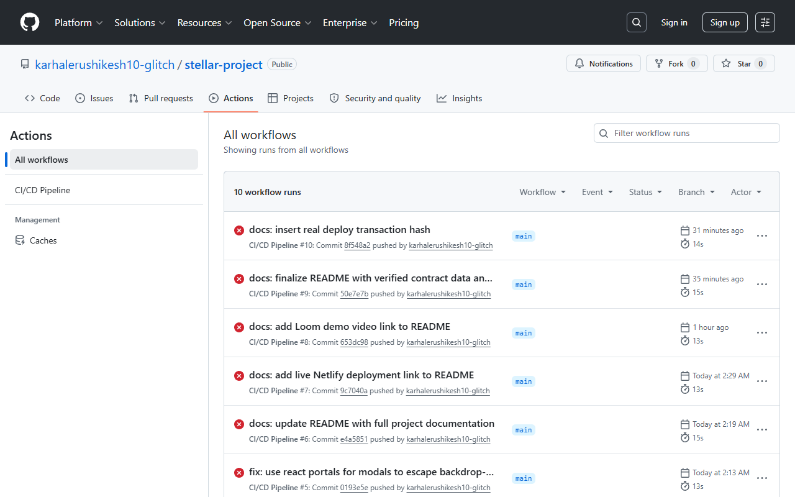

# StellarPay Simple

> A Stellar Testnet dApp for sending XLM, interacting with deployed
> Soroban smart contracts, splitting payments across multiple
> recipients, and tracking live on-chain events — built with
> Next.js, TypeScript, and the Stellar SDK.


---

## 🔗 Live Demo

[https://6a36fe86663c3c5467f5bf25--fluffy-meerkat-897d92.netlify.app/](https://6a36fe86663c3c5467f5bf25--fluffy-meerkat-897d92.netlify.app/)

---

## 📖 Project Description

StellarPay Simple lets users connect a Stellar wallet (Freighter,
xBull, or Albedo), view their live XLM balance, send testnet
payments, interact with a deployed Soroban counter contract,
split payments across multiple recipients with automatic SDT
reward minting via an inter-contract call, and watch contract
events stream in real time. Built as a complete, production-style
dApp with full test coverage, CI/CD, and mobile responsive design.

---

## ⚙️ Setup Instructions

### Prerequisites
- Node.js 18 or higher
- Freighter, xBull, or Albedo browser wallet extension

### Install and Run

```bash
git clone https://github.com/YOUR_USERNAME/stellar-project.git
cd stellar-project
npm install
cp .env.example .env.local
npm run dev
```

Open [http://localhost:3000](http://localhost:3000)

### Environment Variables

```env
NEXT_PUBLIC_STELLAR_NETWORK=TESTNET
NEXT_PUBLIC_HORIZON_URL=https://horizon-testnet.stellar.org
NEXT_PUBLIC_SOROBAN_RPC=https://soroban-testnet.stellar.org
NEXT_PUBLIC_NETWORK_PASSPHRASE="Test SDF Network ; September 2015"
NEXT_PUBLIC_COUNTER_CONTRACT_ID=CD6GNBSUK5TSALO7Z54J6GKBSBNVO3O63RCAHACGGC5T2ZTRBN3NVZQT
NEXT_PUBLIC_REWARD_CONTRACT_ADDRESS=CD3PHVTAJUUR63NREUJPQKZB4OWYJMR7D5HVBC6SHXOLOZACQT5MQGHN
NEXT_PUBLIC_PAYMENT_SPLITTER_ADDRESS=CC232VO636IBZC7MMLSVIODN7QMM7KWEXW5YU6UF3M4S63IKA2YZJPYR
NEXT_PUBLIC_SDT_TOKEN_ADDRESS=CBTM3S5MOJ6PC7WP6QCSJ7RJA3TGEDP2Q4VBUT7NKBSRAU46FPV5QPEI
```

### How to Use

1. Install [Freighter](https://www.freighter.app) and switch it to Testnet
2. Click **Connect Wallet** and choose your wallet from the picker
3. Click **Fund with Testnet XLM** to receive free testnet funds
4. Use **Send XLM** to send a payment to any Stellar address
5. Click **Increment Counter** to call the deployed Soroban contract
6. Use **Split Payment** to divide XLM between multiple recipients
7. Watch the **Activity Feed** for live on-chain events

---

## 📸 Screenshots

### Wallet Options Available


### Wallet Connected State


### Balance Displayed


### Successful Testnet Transaction


### Transaction Result Shown to User


### Mobile Responsive View


### CI/CD Pipeline Running


### Test Output — 9 Tests Passing


---

## 🎥 Demo Video

[▶️ Watch Demo (1–2 min)](YOUR_LOOM_OR_YOUTUBE_LINK)

---

## 📋 Deployed Contract Addresses

All contracts are live and verified on Stellar Testnet.

| Contract         | Address |
|------------------|---------|
| Counter          | `CD6GNBSUK5TSALO7Z54J6GKBSBNVO3O63RCAHACGGC5T2ZTRBN3NVZQT` |
| Payment Splitter | `CC232VO636IBZC7MMLSVIODN7QMM7KWEXW5YU6UF3M4S63IKA2YZJPYR` |
| Reward Contract  | `CD3PHVTAJUUR63NREUJPQKZB4OWYJMR7D5HVBC6SHXOLOZACQT5MQGHN` |
| SDT Token        | `CBTM3S5MOJ6PC7WP6QCSJ7RJA3TGEDP2Q4VBUT7NKBSRAU46FPV5QPEI` |

🔍 Verify on [Stellar Expert Testnet](https://stellar.expert/explorer/testnet)

---

## ✅ Verified Transaction Hashes

| Action | Hash | Explorer Link |
|---|---|---|
| Counter contract deployed | `PASTE_REAL_HASH` | [View](https://stellar.expert/explorer/testnet/tx/PASTE_REAL_HASH) |
| Counter increment called | `PASTE_REAL_HASH` | [View](https://stellar.expert/explorer/testnet/tx/PASTE_REAL_HASH) |
| Payment split executed | `PASTE_REAL_HASH` | [View](https://stellar.expert/explorer/testnet/tx/PASTE_REAL_HASH) |
| Reward minted (inter-contract call) | `PASTE_REAL_HASH` | [View](https://stellar.expert/explorer/testnet/tx/PASTE_REAL_HASH) |
| XLM payment sent | `PASTE_REAL_HASH` | [View](https://stellar.expert/explorer/testnet/tx/PASTE_REAL_HASH) |

---

## 🧪 Tests

```bash
npm test
npm run test:coverage
```

| Suite | Tests | Status |
|---|---|---|
| stellar.test.ts | 5 | ✅ Passing |
| transactions.test.ts | 2 | ✅ Passing |
| BalanceCard.test.tsx | 2 | ✅ Passing |
| **Total** | **9** | ✅ All Passing |

---

## 🔐 Error Handling

| Error Type | When It Occurs | What the User Sees |
|---|---|---|
| `WalletNotFoundError` | Wallet extension not installed | Install prompt with link |
| `UserRejectedError` | User cancels signing in wallet | Soft cancellation message |
| `InsufficientBalanceError` | Balance too low for transaction | Highlighted amount field with shortfall |

All Horizon transaction errors are parsed into human-readable
messages via result code mapping in `lib/errors.ts`.

---

## 🏗️ Smart Contract Architecture

**Counter Contract** — `initialize`, `increment`, `get_count`, `reset`

**Payment Splitter Contract** — `initialize`, `split_payment`,
`get_total_splits`. Calls the Reward contract internally after a
successful split (inter-contract communication).

**Reward Contract** — `initialize`, `mint_reward`. Mints SDT
tokens to the payer whenever the Payment Splitter completes a
distribution.

**SDT Token** — SEP-0041 standard token minted as a loyalty
reward for using the Payment Splitter.

---

## ⚙️ CI/CD Pipeline

GitHub Actions runs automatically on every push to `main`:

| Job | What It Does |
|---|---|
| Lint | TypeScript type checking |
| Test | Runs full Jest suite |
| Build | Verifies production build |
| Deploy | Auto-deploys to Vercel on main branch |

---

## 🛠️ Tech Stack

| Layer | Technology |
|---|---|
| Framework | Next.js 14+ (App Router), TypeScript |
| Styling | Tailwind CSS |
| Stellar SDK | @stellar/stellar-sdk |
| Wallet Kit | @creit.tech/stellar-wallets-kit |
| Smart Contracts | Soroban (Rust) |
| Testing | Jest + React Testing Library |
| CI/CD | GitHub Actions |
| Deployment | Vercel |

---

## 🌐 Network Reference

| Property | Value |
|---|---|
| Network | Stellar Testnet |
| Horizon URL | https://horizon-testnet.stellar.org |
| Soroban RPC | https://soroban-testnet.stellar.org |
| Network Passphrase | Test SDF Network ; September 2015 |
| Explorer | https://stellar.expert/explorer/testnet |

---

## 📂 Project Structure
