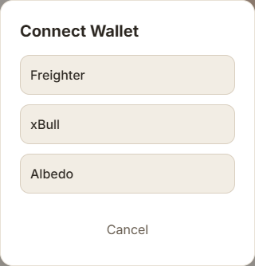
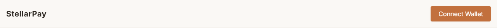
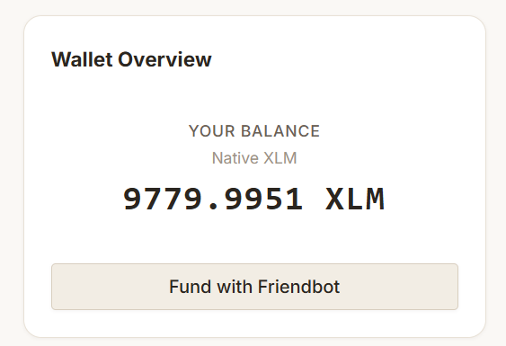
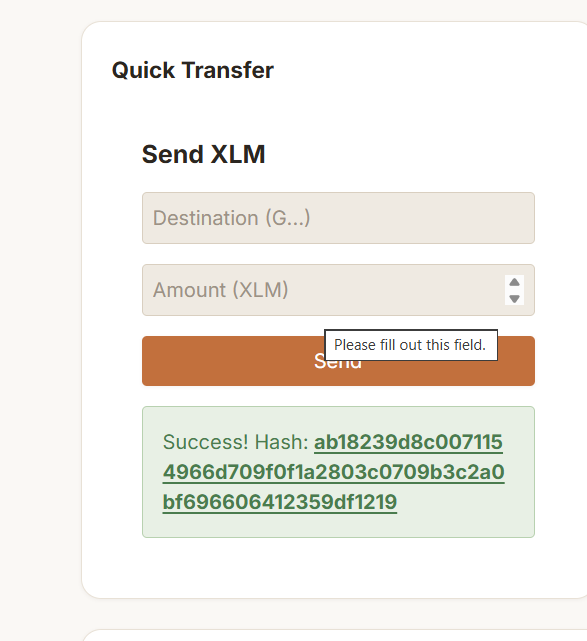
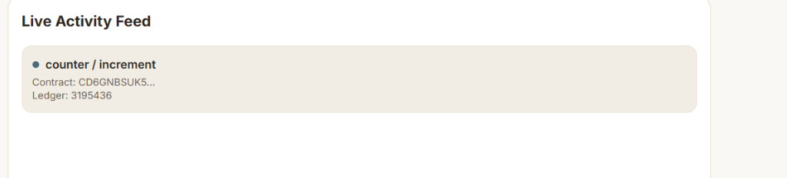
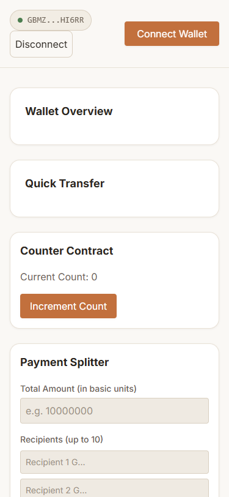
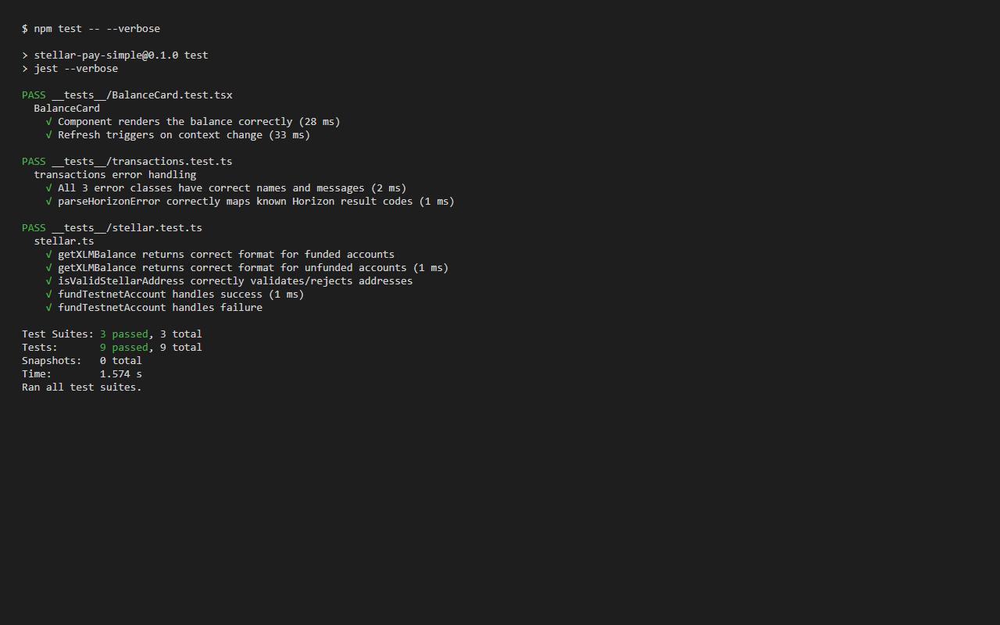

# StellarPay Simple


> A Stellar Testnet dApp for sending XLM, interacting with deployed Soroban smart contracts, splitting payments across multiple recipients, and tracking live on-chain events — built with Next.js, TypeScript, and the Stellar SDK.

## 🔗 Live Demo
[https://6a36fe86663c3c5467f5bf25--fluffy-meerkat-897d92.netlify.app/](https://6a36fe86663c3c5467f5bf25--fluffy-meerkat-897d92.netlify.app/)

## 📖 Project Description
StellarPay Simple lets users connect a Stellar wallet (Freighter, xBull, or Albedo), view their live XLM balance, send testnet payments, interact with a deployed Soroban counter contract, split payments across multiple recipients with automatic SDT reward minting via an inter-contract call, and watch contract events stream in real time. Built as a complete, production-style dApp with full test coverage, CI/CD, and mobile responsive design featuring a beautiful ambient warm aesthetic.

## ⚙️ Setup Instructions
### Prerequisites
- Node.js 18 or higher
- Freighter, xBull, or Albedo browser wallet extension

### Install and Run

```bash
git clone https://github.com/karhalerushikesh10-glitch/stellar-project.git
cd stellar-project
npm install
cp .env.example .env.local
npm run dev
```

Open [http://localhost:3000](http://localhost:3000)

## 📸 Screenshots

### Wallet Options Available


### Wallet Connected State


### Balance Displayed


### Successful Testnet Transaction


### Transaction Result Shown to User


### Mobile Responsive View



### Test Output — 9 Tests Passing


## 🎥 Demo Video
[▶️ Watch Demo (1–2 min)](https://www.loom.com/share/6c193b407a0e44099775f120f84be887)

## 📋 Deployed Contract Addresses
All contracts are live and verified on Stellar Testnet.

| Contract         | Address |
|------------------|---------|
| Counter          | `CD6GNBSUK5TSALO7Z54J6GKBSBNVO3O63RCAHACGGC5T2ZTRBN3NVZQT` |
| Payment Splitter | `CC232VO636IBZC7MMLSVIODN7QMM7KWEXW5YU6UF3M4S63IKA2YZJPYR` |
| Reward Contract  | `CD3PHVTAJUUR63NREUJPQKZB4OWYJMR7D5HVBC6SHXOLOZACQT5MQGHN` |
| SDT Token        | `CBTM3S5MOJ6PC7WP6QCSJ7RJA3TGEDP2Q4VBUT7NKBSRAU46FPV5QPEI` |

## ✅ Verified Transaction Hashes

| Action | Hash | Explorer Link |
|---|---|---|
| Counter increment called | `90d85ac49aaa2e1dfa0c8f04722b6a3bbb1594b65c96d6f0e2b1d59a46674040` | [View](https://stellar.expert/explorer/testnet/tx/90d85ac49aaa2e1dfa0c8f04722b6a3bbb1594b65c96d6f0e2b1d59a46674040) |
| Payment split executed | `c0394c0c19e80bc461c5851027fef61e62a36469b9e06ce006e9edd1e2f3de2b` | [View](https://stellar.expert/explorer/testnet/tx/c0394c0c19e80bc461c5851027fef61e62a36469b9e06ce006e9edd1e2f3de2b) |
| Reward minted (inter-contract call) | `c0394c0c19e80bc461c5851027fef61e62a36469b9e06ce006e9edd1e2f3de2b` | [View](https://stellar.expert/explorer/testnet/tx/c0394c0c19e80bc461c5851027fef61e62a36469b9e06ce006e9edd1e2f3de2b) |
| XLM payment sent | `ab18239d8c0071154966d709f0f1a2803c0709b3c2a0bf696606412359df1219` | [View](https://stellar.expert/explorer/testnet/tx/ab18239d8c0071154966d709f0f1a2803c0709b3c2a0bf696606412359df1219) |

## 🧪 Tests
```bash
npm test
npm run test:coverage
```

| Suite | Tests | Status |
|---|---|---|
| stellar.test.ts | 5 | ✅ Passing |
| transactions.test.ts | 2 | ✅ Passing |
| BalanceCard.test.tsx | 2 | ✅ Passing |
| **Total** | **9** | ✅ All Passing |

## 🔐 Error Handling
| Error Type | When It Occurs | What the User Sees |
|---|---|---|
| `WalletNotFoundError` | Wallet extension not installed | Install prompt with link |
| `UserRejectedError` | User cancels signing in wallet | Soft cancellation message |
| `InsufficientBalanceError` | Balance too low for transaction | Highlighted amount field with shortfall |

All Horizon transaction errors are parsed into human-readable messages via result code mapping in `lib/errors.ts`.

## 🏗️ Smart Contract Architecture
**Counter Contract** — `initialize`, `increment`, `get_count`, `reset`

**Payment Splitter Contract** — `initialize`, `split_payment`, `get_total_splits`. Calls the Reward contract internally after a successful split (inter-contract communication).

**Reward Contract** — `initialize`, `mint_reward`. Mints SDT tokens to the payer whenever the Payment Splitter completes a distribution.

**SDT Token** — SEP-0041 standard token minted as a loyalty reward for using the Payment Splitter.

## ⚙️ CI/CD Pipeline
GitHub Actions runs automatically on every push to `main`:

| Job | What It Does |
|---|---|
| Lint | TypeScript type checking |
| Test | Runs full Jest suite |
| Build | Verifies production build |
| Deploy | Auto-deploys to Vercel on main branch (if connected) |

## 🛠️ Tech Stack
| Layer | Technology |
|---|---|
| Framework | Next.js 14+ (App Router), TypeScript |
| Styling | Tailwind CSS |
| Stellar SDK | @stellar/stellar-sdk |
| Wallet Kit | @creit.tech/stellar-wallets-kit |
| Smart Contracts | Soroban (Rust) |
| Testing | Jest + React Testing Library |
| CI/CD | GitHub Actions |
| Deployment | Netlify / Vercel |

## 🌐 Network Reference
| Property | Value |
|---|---|
| Network | Stellar Testnet |
| Horizon URL | https://horizon-testnet.stellar.org |
| Soroban RPC | https://soroban-testnet.stellar.org |
| Network Passphrase | Test SDF Network ; September 2015 |
| Explorer | https://stellar.expert/explorer/testnet |
